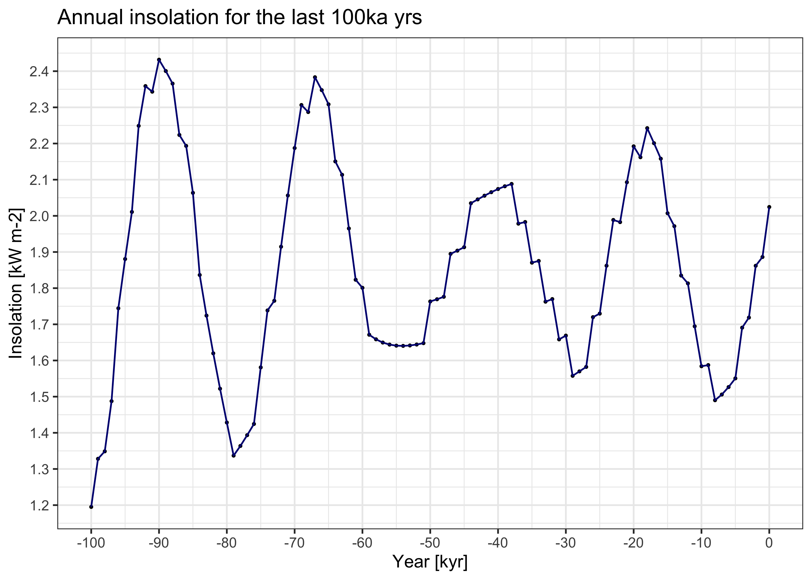

<!-- README.md is generated from README.Rmd. Please edit that file -->

# Palinsol

R package to compute Incoming Solar Radiation (insolation) for
paleoclimate studies. Features three solutions: BER78, BER90 and LA04.
Computes hourly, daily-mean, season-averaged and annual means for all
latitudes.

<!-- badges: start -->

[](https://cran.r-project.org/package=palinsol)
[](https://cran.r-project.org/package=palinsol)
[](https://github.com/special-uor/palinsol)
[](https://github.com/special-uor/palinsol/actions)
<!-- badges: end -->

## Installation

You can install the released version of palinsol from
[CRAN](https://CRAN.R-project.org) with:

``` r
install.packages("palinsol")
```

And the development version from [GitHub](https://github.com/) with:

``` r
# install.packages("devtools")
devtools::install_github("special-uor/palinsol")
```

## Example

### Calculation of orbital parameters

The function `palinsol::astro` can be used to find the orbital paraters.
This function takes three arguments:

  - `t`: time, years after 1950.
  - `solution`: solution used. One of `palinsol::ber78` (Berger, 1978),
    `palinsol::ber90` (Berger and Loutre, 1991) or `palinsol::la04`
    (Laskar, 2004).
  - `degree`: returns angles in degrees if `TRUE`.

For example, to find the orbital parameters for the last 100k years with
1k years resolution:

``` r
# Load the pipe operator from `magrittr`
`%>%` <- magrittr::`%>%`

# Create sequence (vector) with years
years <- seq(from = -10^5, to = 0, by = 1000)

# Find orbital parameters
orb_param <- years %>%
  purrr::map_df(palinsol::astro, solution = palinsol::ber78, degree = TRUE)
#> load BER78data

# Append the years to the table with the orbital parameters
orb_param <- orb_param %>%
  dplyr::mutate(year = years, .before = 1)

# Print table with the first 10 rows
orb_param %>%
  dplyr::slice(1:10) %>%
  knitr::kable()
```

|     year |      eps |       ecc |    varpi |      epsp |
| -------: | -------: | --------: | -------: | --------: |
| \-100000 | 23.70902 | 0.0387423 | 178.4873 | 0.3912183 |
|  \-99000 | 23.83934 | 0.0384086 | 194.4552 | 0.3924701 |
|  \-98000 | 23.95612 | 0.0380598 | 210.3612 | 0.3940328 |
|  \-97000 | 24.05717 | 0.0376963 | 226.2127 | 0.3958623 |
|  \-96000 | 24.14078 | 0.0373188 | 242.0180 | 0.3979110 |
|  \-95000 | 24.20567 | 0.0369279 | 257.7851 | 0.4001294 |
|  \-94000 | 24.25103 | 0.0365241 | 273.5225 | 0.4024670 |
|  \-93000 | 24.27642 | 0.0361079 | 289.2382 | 0.4048736 |
|  \-92000 | 24.28181 | 0.0356796 | 304.9401 | 0.4073000 |
|  \-91000 | 24.26751 | 0.0352398 | 320.6358 | 0.4096985 |

Create plots for all the variables

``` r
orb_param %>%
  tidyr::pivot_longer(cols = c(eps, ecc, varpi, epsp),
                      names_to = "var") %>%
  ggplot2::ggplot(ggplot2::aes(year, value)) +
  ggplot2::geom_point() +
  ggplot2::geom_line() +
  ggplot2::facet_wrap(facets = ~var, 
                      scales = "free",
                      labeller = ggplot2::labeller(var = c("ecc" = "Eccentricity (ecc)",
                                                           "eps" = "Obliquity (eps)",
                                                           "varpi" = "True Solar Longitude of the Perihelion (varpi)",
                                                           "epsp" = "(epsp)"))) +
  ggplot2::theme_bw()
```


### Time series of monthly and annual insolation

The `palinsol::Insol` function, computes incoming solar radiation
(insolation) for a given astronomical configuration, true solar
longitude and latitude. This function takes five arguments:

  - `orbit`: output from a solution, such as `palinsol::ber78` (Berger,
    1978), `palinsol::ber90` (Berger and Loutre, 1991) or
    `palinsol::la04` (Laskar, 2004).
  - `long`: true solar longitude
  - `lat`: latitude
  - `S0`: total solar irradiance
  - `H`: sun hour angle, in radians

For example, we can find the monthly insolation for the last 100ka years
at Lago di Fimon (45.469951, 11.543468) as follows:

``` r
# Load the pipe operator from `magrittr`
`%>%` <- magrittr::`%>%`

# Generate a sequence (vector) with mid-month values
mid_month <- seq(from = 15.5, to = 345.5, by = 30)

# Calculate the True Solar Longitudes (TSL) for present-day mid-month values
tt_present <- 0.0
orbit_present <- palinsol::astro(t = tt_present, 
                                 solution = palinsol::ber78, 
                                 degree = FALSE)
mid_month_tsl_present <- palinsol::day2l(orbit = orbit_present, 
                                     day = mid_month)

# Calculate orbital parameters for the last 100 ka years
## Create sequence (vector) with years
years <- seq(from = -10^5, to = 0, by = 1000)

## Find orbital parameters
orb_param <- years %>%
  purrr::map_df(palinsol::astro, solution = palinsol::ber78, degree = FALSE)

## Append the years to the table with the orbital parameters
orb_param <- orb_param %>%
  dplyr::mutate(year = years, .before = 1)


# Calculate the insolation values at the location of interest
## Set the latitude of interest
lat <- 45.469951

insol_tbl <- mid_month_tsl_present %>%
  purrr::map(palinsol::Insol, orbit = orb_param, lat = lat * pi / 180, S0 = 1365) %>%
  magrittr::set_names(c("Jan", "Feb", "Mar", "Apr", "May", "Jun", "Jul", "Aug", "Sep", "Oct", "Nov", "Dec")) %>%
  tibble::as_tibble()

## Append the years to the table with the insolation values
insol_tbl <- insol_tbl %>%
  dplyr::mutate(year = years, .before = 1)

## Print table with the first 10 rows
insol_tbl %>%
  dplyr::slice(1:10) %>%
  knitr::kable()
```

|     year |      Jan |      Feb |      Mar |      Apr |      May |      Jun |      Jul |      Aug |      Sep |      Oct |      Nov |      Dec |
| -------: | -------: | -------: | -------: | -------: | -------: | -------: | -------: | -------: | -------: | -------: | -------: | -------: |
| \-100000 | 124.0101 | 181.0133 | 268.0831 | 363.8207 | 447.9725 | 500.4858 | 503.7695 | 453.0026 | 359.7041 | 249.9477 | 158.8057 | 114.2052 |
|  \-99000 | 125.7372 | 183.2168 | 269.3186 | 361.8157 | 441.6284 | 491.1041 | 494.5095 | 446.9037 | 357.7452 | 250.7414 | 160.2843 | 115.5782 |
|  \-98000 | 127.6175 | 186.1449 | 272.0961 | 361.9913 | 437.4057 | 482.9067 | 484.9905 | 439.3417 | 353.9491 | 250.1411 | 161.0694 | 116.7450 |
|  \-97000 | 129.4630 | 189.5375 | 276.1745 | 364.2949 | 435.5818 | 476.5112 | 476.0004 | 430.9993 | 348.6911 | 248.2196 | 161.0808 | 117.5760 |
|  \-96000 | 131.0980 | 193.1080 | 281.2264 | 368.5281 | 436.2517 | 472.3652 | 468.2334 | 422.5767 | 342.4458 | 245.1583 | 160.3094 | 117.9782 |
|  \-95000 | 132.3725 | 196.5636 | 286.8592 | 374.3609 | 439.3318 | 470.7312 | 462.2482 | 414.7341 | 335.7390 | 241.2249 | 158.8147 | 117.9017 |
|  \-94000 | 133.1743 | 199.6269 | 292.6399 | 381.3517 | 444.5703 | 471.6816 | 458.4410 | 408.0453 | 329.1005 | 236.7455 | 156.7167 | 117.3424 |
|  \-93000 | 133.4370 | 202.0578 | 298.1262 | 388.9743 | 451.5640 | 475.1034 | 457.0329 | 402.9651 | 323.0231 | 232.0735 | 154.1832 | 116.3413 |
|  \-92000 | 133.1454 | 203.6735 | 302.8994 | 396.6524 | 459.7820 | 480.7091 | 458.0658 | 399.8083 | 317.9303 | 227.5600 | 151.4129 | 114.9789 |
|  \-91000 | 132.3348 | 204.3632 | 306.5991 | 403.8004 | 468.5986 | 488.0544 | 461.4077 | 398.7403 | 314.1525 | 223.5286 | 148.6188 | 113.3675 |

### Plots

##### Plot insolation for January

``` r
insol_tbl %>%
  tidyr::pivot_longer(cols = 2:13, names_to = "month") %>%
  dplyr::mutate(year = year / 1000) %>%
  dplyr::filter(month %in% c("Jan")) %>%
  ggplot2::ggplot(ggplot2::aes(year, value)) +
  ggplot2::geom_point(size = 0.5) +
  ggplot2::geom_line(colour = "navyblue") +
  ggplot2::labs(x = "Year [kyr]", 
                y = "Insolation [W m-2]",
                title = "January's insolation for the last 100ka yrs") +
  ggplot2::scale_x_continuous(breaks = scales::pretty_breaks(10)) +
  ggplot2::theme_bw()
```


##### Plot insolation by season

``` r
insol_tbl %>%
  tidyr::pivot_longer(cols = 2:13, names_to = "month") %>%
  dplyr::mutate(month = factor(month,
                               levels = c("Jan", "Feb", "Mar", "Apr", "May", "Jun", "Jul", "Aug", "Sep", "Oct", "Nov", "Dec")),
                season = ifelse(month %in% c("Mar", "Apr", "May"),
                                "Spring",
                                ifelse(month %in% c("Jun", "Jul", "Aug"),
                                       "Summer",
                                       ifelse(month %in% c("Sep", "Oct", "Nov"),
                                              "Autumn",
                                              "Winter"))),
                season = factor(season,
                                levels = c("Spring", "Summer", "Autumn", "Winter"))) %>%
  ggplot2::ggplot(ggplot2::aes(year, value, colour = month)) +
  ggplot2::geom_point(size = 0.5) +
  ggplot2::geom_line() +
  ggplot2::labs(x = "Year", y = "Insolation [W m-2]") + 
  ggplot2::facet_wrap(facets = ~season, nrow = 2) +
  ggplot2::theme_bw()
```


##### Plot annual insolation

``` r
insol_tbl %>%
  dplyr::group_by(year) %>% 
  dplyr::summarise(value = sum(Jan:Dec)) %>%
  dplyr::mutate(value = value / 1000,
                year = year / 1000) %>%
  ggplot2::ggplot(ggplot2::aes(year, value)) +
  ggplot2::geom_point(size = 0.5) +
  ggplot2::geom_line(colour = "navyblue") +
  ggplot2::labs(x = "Year [kyr]", 
                y = "Insolation [kW m-2]",
                title = "Annual insolation for the last 100ka yrs") +
  ggplot2::scale_x_continuous(breaks = scales::pretty_breaks(10)) +
  ggplot2::theme_bw()
```


